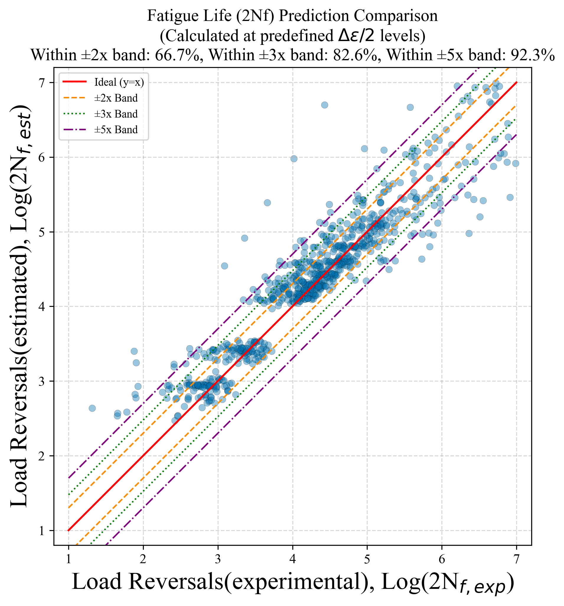
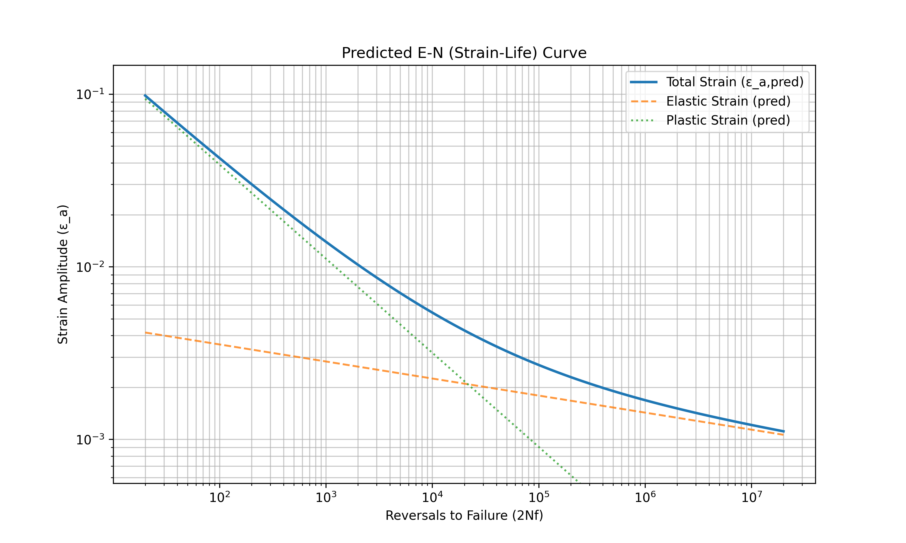
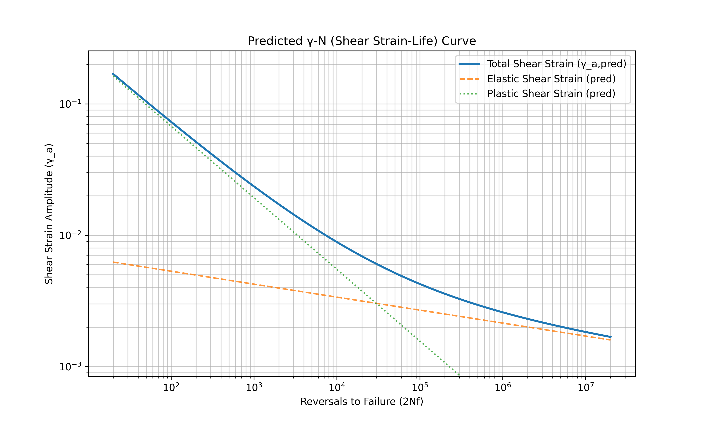

# 🚀 Advanced Fatigue Life Predictor

A machine learning-based system to predict **tensile (ε–N)** and **shear (γ–N)** fatigue life curves using either **basic material properties** or **alloy composition** — guided by physical principles.

🌐 [**▶ Try the Live Web App**](https://fatigue-life-prediction-6zfzg2ae9wdtnan3cutbyi.streamlit.app/)  
*(Note: The latest version may differ depending on deployment status.)*

---

## 📌 Overview

This project implements a **Physics-Informed Neural Network (PINN)** to estimate fatigue life behavior of metallic materials. Users can choose between two input modes:

- **Monotonic Properties**: E, YS, TS, HB, ν
- **Alloy Composition**: Elemental wt% (e.g., C, Mn, Cr, Mo, P, S)

Based on these, the model predicts:

- **Tensile fatigue parameters**: σ′<sub>f</sub>, b, ε′<sub>f</sub>, c
- **Shear fatigue parameters**: τ′<sub>f</sub>, b₀, γ′<sub>f</sub>, c₀ (via TS-dependent conversion)

It generates and visualizes fatigue curves:
- ε–N curve (tensile)
- γ–N curve (shear)

### 🔧 Core Features
- Dual input modes: **static properties** or **chemical composition**
- PINN model combining **data-driven learning** and **physics-based constraints**
- UTS-based **tensile-to-shear transformation strategy**
- Streamlit-powered **interactive web interface**
- Real-time curve generation and visualization

---

## ⚙️ Local Installation

### 1. Clone the Repository
```bash
git clone https://github.com/dumbbellcollector/fatigue-life-predictor.git
cd fatigue-life-predictor
```

### 2. Install Dependencies
Python 3.8+ is required. Install libraries via pip:

```bash
pip install -r requirements.txt
```

Key packages:
- `streamlit>=1.25`
- `torch>=2.0`
- `joblib`, `numpy`, `pandas`, `matplotlib`, `scikit-learn`

### 3. Run the App
```bash
streamlit run FatiguePredictor0529.py
```
Ensure the following files are in the working directory:
- `best_fatigue_pinn_model.pth`
- `scaler_X.pkl`
- `scalers_y.pkl`
- `composition_to_properties.py`

---

## 💻 Demo Snapshots

### 🔹 Model Accuracy

| Fatigue Parameters | Load Reversals(2N_f) |
|----------------------|------------------------|
|  |  |

### 🔹 Example Output Curves

| Tensile (ε–N) | Shear (γ–N) |
|---------------|-------------|
|  |  |

---

## 📁 File Structure

```
.
├── FatiguePredictor.py        	      # Main web app
├── main.ipynb                        # Training notebook
├── composition_to_properties.py      # Alloy composition → static property model
├── best_fatigue_pinn_model.pth       # Trained model weights
├── scaler_X.pkl                      # Input scaler
├── scalers_y.pkl                     # Output scaler
├── requirements.txt                  # Package list
├── images/                           # Demo images
└── README.md                         # This file
```

---

## 🔬 Model Highlights

- **PINN Framework**: Combines MSE loss with physics-based terms (e.g., Coffin-Manson consistency)
- **Flexible Input**: Predict from measured properties or chemical composition
- **Shear Fatigue Estimation**: Uses UTS thresholds to apply von Mises, max principal, or interpolation
- **Scatter Band Evaluation**: Accuracy benchmarked using 2× scatter band inclusion rate
- **Interactive GUI**: Visualize fatigue curves instantly from browser

---

## 📊 Changelog

| Date | Updates |
|------|---------|
| 2024.05.29 | New: Composition-based input mode; added `composition_to_properties.py`; UI update |
| 2024.05.14 | Reverted to partially data-driven estimation for select parameters |
| 2024.05.08 | Experimented with traditional physics-based estimation inside loss |
| 2024.04.27 | Improved shear parameter conversion based on TS; GUI enhancement |
| 2024.04.14 | Extended to predict both tensile and shear fatigue curves |
| 2024.04.11 | Migrated from TensorFlow to PyTorch; GUI development initiated |
| 2024.03.31 | Initial development (TensorFlow); added basic physics constraints |

---

## 📈 Progress & Accuracy

- ✅ PINN model validated on 600+ material samples
- ✅ Tensile and shear fatigue curve generation available
- ✅ 2Nf prediction accuracy: **66.7% within 2× scatter band**
- ⚠️ **ε′<sub>f</sub>** prediction remains challenging due to nonlinear data spread

---

## 🧪 Ongoing & Future Work

### ✅ Current
- Further refinement of `Alloy Composition Input` mode
- Improving prediction accuracy for ε′<sub>f</sub>

### 🔜 Upcoming
- Upload and compare user experimental fatigue data
- Batch prediction for multiple materials
- Enhanced property estimation (composition → HB, YS, TS)
- Uncertainty quantification & confidence intervals
- Public API access

---

## 🤝 Contributions Welcome!

Ways to help:
- Extend material database
- Improve model accuracy or generalization
- Suggest/implement new fatigue transformations
- Enhance UI/UX or documentation

---

## 📄 License

MIT License. See [`LICENSE`](LICENSE) for details.

---

## 📢 Acknowledgements

This project is part of ongoing academic research into data-efficient, physics-consistent fatigue design tools.  
Special thanks to R. Basan (2024) for benchmark methodology.

---

## 📬 Contact

**YeoJoon Yoon**  
📧 Email: goat@sogang.ac.kr  
🐙 GitHub: [dumbbellcollector](https://github.com/dumbbellcollector)
